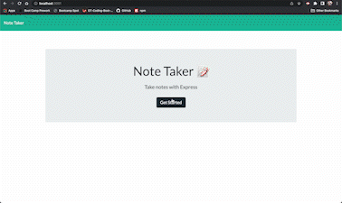

# Note Taker

-This app allows the user to put input and save them as notes.

## How to use

- Once deployed to heroku anyone can use the application to take notes.

## GitHub

[GitHub Site](https://github.com/wmskillas/Note-Taker)

## Example

